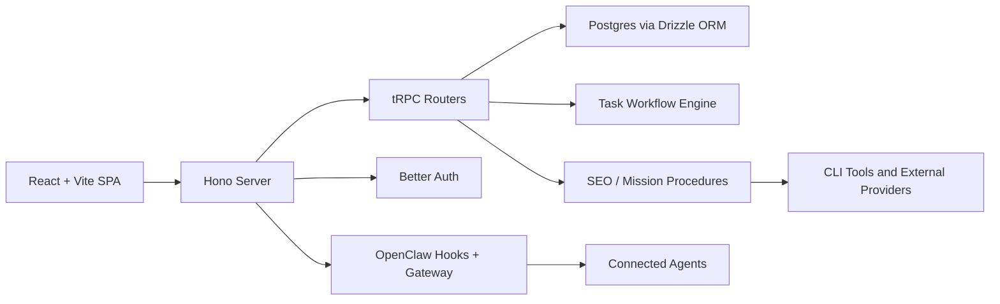

# HQ

HQ is a control plane for human-directed AI operations.

It brings agent orchestration, task execution, mission planning, SEO intelligence, approval flows, usage analytics, and workspace visibility into one product. The goal is not just to "chat with agents", but to run repeatable business work with structure, accountability, and live operational feedback.

## What HQ Does

HQ is built around a simple idea: if AI agents are going to do meaningful work, they need the same operating surface that teams do.

This project provides that surface:

- A multi-tenant operator dashboard for teams managing AI agents
- A task system for simple execution with rich metadata, comments, and agent notifications
- Mission, objective, and campaign tracking for longer-running strategic work
- Live OpenClaw gateway connectivity for approvals, logs, events, and agent state
- An SEO intelligence workspace backed by stored crawl, analytics, keyword, backlink, and competitor data
- File and skill introspection for connected agents
- Usage analytics for understanding session activity, token/cost trends, and operational health

This is the kind of product I like building most: systems that sit at the intersection of product design, developer tooling, workflow automation, and real operational leverage.

## What is different about HQ?

HQ is not a demo dashboard. It spans the full stack:

- Product and UX: a real operator console with distinct workflows for tasks, missions, files, SEO, and usage
- Application architecture: a typed React frontend, Hono server, tRPC API layer, and Drizzle/Postgres data model
- Agent systems design: hook-based task triggering, live agent session linking, and human-in-the-loop approvals
- Business use cases: campaign tracking, operational task routing, and SEO/GEO analysis
- Platform thinking: auth, org boundaries, invite-only onboarding, deployment scripts, CLI tooling, and runtime integration with an external gateway

If someone wants to understand the kind of product and systems work I can own end-to-end, this repository is a good example.

## Core Capabilities

### 1. Agent Operations

- Live dashboard for connected agents and activity state
- Gateway-backed status, logs, approval panels, and events
- Agent file browsing and skill inspection from the HQ UI
- Admin-only views for operational visibility and control

### 2. Task Execution

- Kanban-based task management
- Rich task metadata including assignee, urgency, due dates, and comments
- A single simple-task model across the app, API, and agent tools
- Direct agent notifications for assigned tasks

### 3. Missions, Objectives, and Campaigns

- Missions assigned to agents
- Objectives nested under missions
- Campaigns attached to objectives with lifecycle tracking
- A structure for turning high-level goals into measurable operational work

### 4. SEO and GEO Intelligence

- Site-level overview across pages, clusters, competitors, and analytics
- Stored crawl and audit data for tracked pages
- Keyword cluster and page-cluster mapping
- Competitor domain footprints and ranked keyword snapshots
- Analytics summaries and backlink-oriented workflows
- CLI support for DataForSEO and Google Search Console powered workflows

### 5. Usage Analytics

- Session-level usage breakdowns
- Token and cost trend views
- Session log inspection
- Filtering by day, hour, session, role, and tool usage

## System Overview



## Architecture

### Frontend

- React 19 + Vite
- React Router for app navigation
- TanStack Query + tRPC client for typed data access
- Tailwind CSS and shared UI primitives
- Dedicated product areas for dashboard, tasks, missions, SEO, files, usage, settings, and auth

### Backend

- Node-based Hono server
- tRPC for typed procedures
- Better Auth for authentication, session handling, organizations, and admin roles
- Drizzle ORM for schema and queries
- REST endpoints for auth, invitation lookup, uploads, and event streams

### Data Model

The schema is split into a few clear domains:

- `auth`: users, sessions, organizations, members, invitations, API keys
- `core`: tasks, comments, and agent database bindings
- `custom`: missions and objectives
- `marketing`: campaigns
- `seo`: sites, crawls, pages, clusters, queries, analytics, competitors, backlinks, and GEO/SEO support tables

### Runtime Model

- Development:
  - Vite serves the frontend on `http://127.0.0.1:5174`
  - The Node API runs on `http://127.0.0.1:8787`
  - Vite proxies `/api/*` to the backend
- Production:
  - the frontend is built into `dist/`
  - the server is bundled into `dist-server/server/index.js`
  - one Node process serves both the SPA and `/api/*`

## Security and Privacy

This repository is structured to avoid exposing live credentials:

- runtime secrets are expected through local `.env` or `.dev.vars` files
- real secret values are not documented in this README
- a scrubbed `.env.example` is provided for setup
- generated local asset output is ignored from git
- common credential file types are ignored from git
- auth is organization-aware, and account creation is invite-gated by default

Important publishing note:

- the root `openclaw/` directory is a git submodule reference
- full gateway integration depends on access to that submodule
- HQ itself is documented so the architecture and main app remain understandable even without private runtime credentials

## Local Development

### Prerequisites

- Bun
- Node.js 22+
- Postgres
- Optional: an OpenClaw gateway instance if you want live agent connectivity

### 1. Install dependencies

```bash
bun install
```

### 2. Create your local env file

```bash
cp .env.example .env
```

Fill in the placeholders with your local values. Do not commit `.env`.

### 3. Apply database schema

```bash
bun run db:push
```

### 4. Bootstrap the first organization and admin

```bash
bun run bootstrap:hq
```

### 5. Start the app

```bash
bun run dev
```

Then open:

- `http://127.0.0.1:5174` for the web app
- `http://127.0.0.1:8787/api/health` for a quick backend health check

## Environment Variables

The app reads `.env` and `.dev.vars` locally. A safe template lives in `.env.example`.

### Required

- `DATABASE_URL`
- `BETTER_AUTH_SECRET`
- `BETTER_AUTH_URL`

### Commonly Used

- `ALLOWED_ORIGINS`
- `AGENT_API_TOKEN`
- `OPENCLAW_HOOKS_URL`
- `OPENCLAW_HOOKS_TOKEN`
- `VITE_GATEWAY_URL`
- `VITE_GATEWAY_TOKEN`
- `LEAD_AGENT_ID`

### Bootstrapping / Admin

- `BOOTSTRAP_ORG_NAME`
- `BOOTSTRAP_ORG_SLUG`
- `BOOTSTRAP_ADMIN_NAME`
- `BOOTSTRAP_ADMIN_EMAIL`
- `BOOTSTRAP_ADMIN_PASSWORD`
- `SUPER_ADMIN_EMAIL`
- `SUPER_ADMIN_NAME`
- `SUPER_ADMIN_PASSWORD`
- `SUPER_ADMIN_EMAILS`
- `ADMIN_EMAILS`

### Storage

- `S3_BUCKET`
- `S3_REGION`
- `S3_ENDPOINT_URL`
- `S3_PUBLIC_BASE_URL`
- `S3_ACCESS_KEY_ID`
- `S3_SECRET_ACCESS_KEY`

### SEO Provider Credentials

- `DATAFORSEO_LOGIN`
- `DATAFORSEO_PASSWORD`

## Useful Scripts

```bash
bun run dev
bun run build
bun run start
bun run test
bun run lint
bun run db:push
bun run db:generate
bun run bootstrap:hq
bun run grant:super-admin
```

There are also focused agent-facing CLIs in this repo:

- `cli/seo`
- `cli/framer`
- `cli/aweber`
- `cli/ebook`

## Repository Structure

```text
src/                 frontend application
worker/              Hono app, tRPC routers, domain services
server/              Node entrypoint for local/prod serving
drizzle/schema/      typed Postgres schema
shared/              shared task/domain types
plugins/             OpenClaw-facing plugins
cli/                 supporting automation and provider CLIs
scripts/             bootstrap, migration, and admin utilities
docs/                product and roadmap notes
openclaw/            OpenClaw submodule used for deeper gateway integration
```

## Deployment

For a full EC2-based deployment flow, see [EC2_RUNBOOK.md](./EC2_RUNBOOK.md).

At a high level:

1. Provision Postgres and runtime secrets
2. Build HQ
3. Run migrations / bootstrap the org
4. Connect HQ to OpenClaw via hooks and gateway settings
5. Serve the bundled Node app behind your preferred reverse proxy
